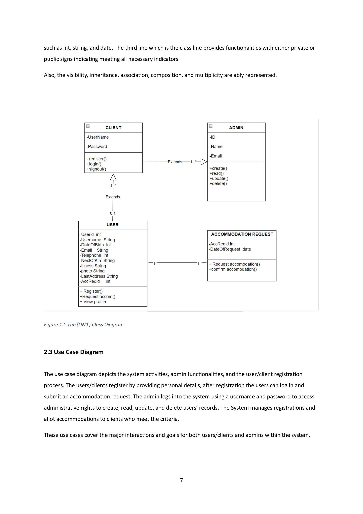
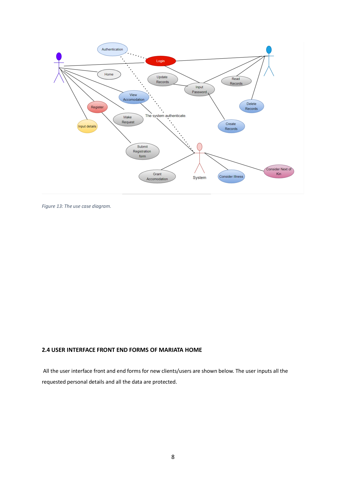
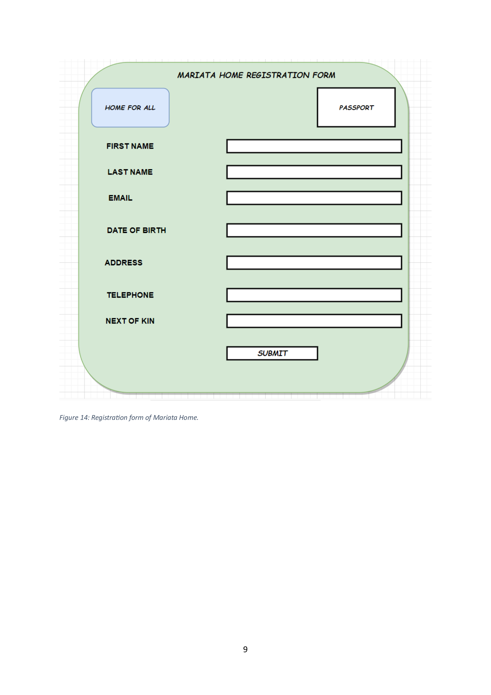
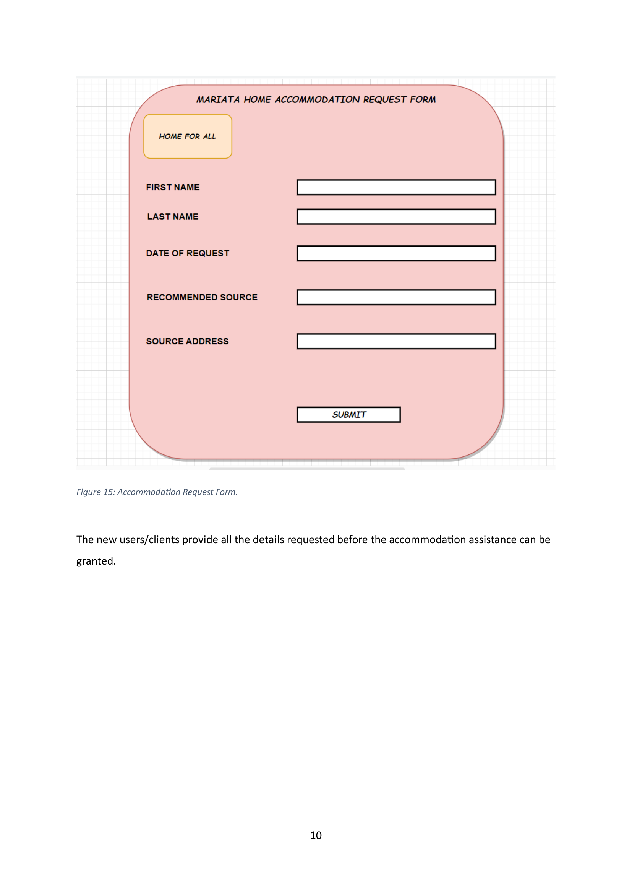
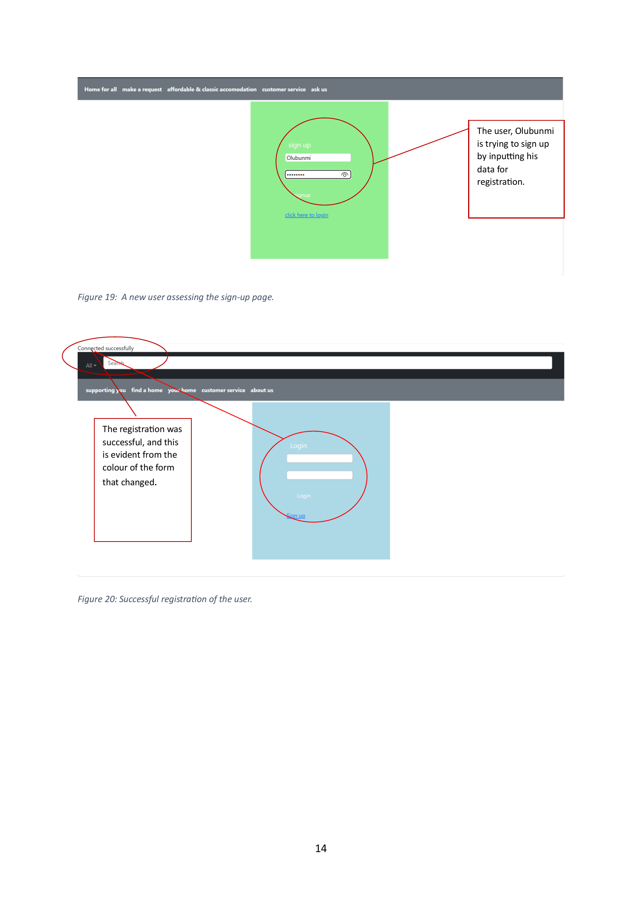
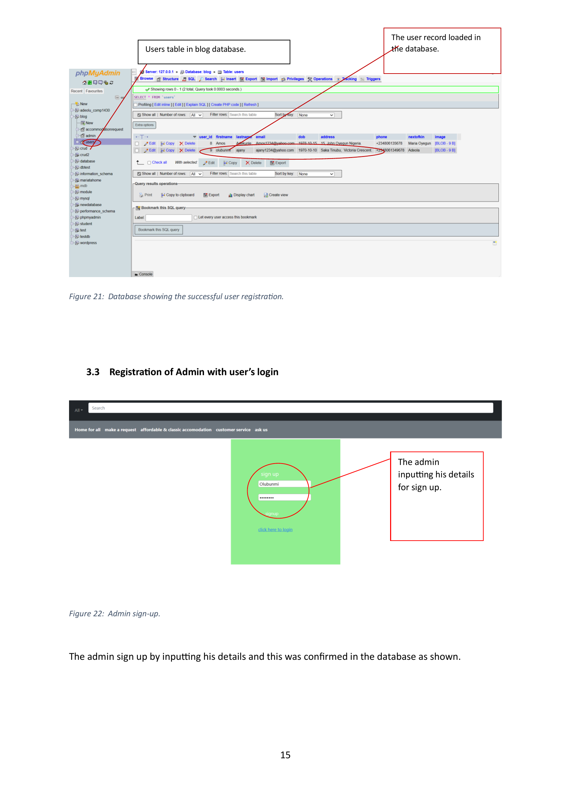
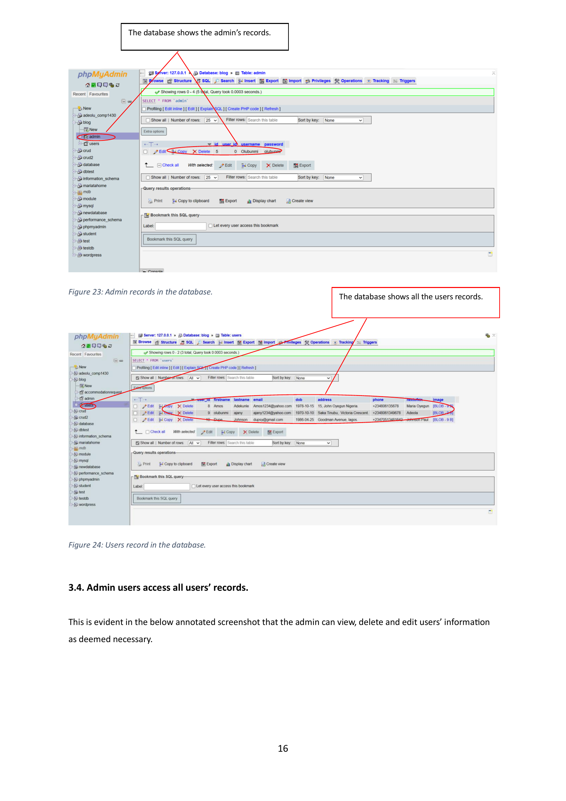
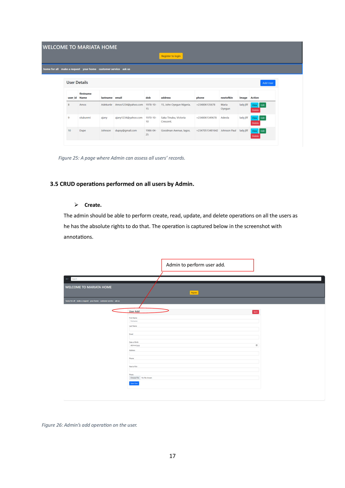

# Mariata Homes Web-Based CRUD System

This is a system design and development project created during my postgraduate studies at the University of Greenwich. The solution addresses the digital transformation needs of Mariata Homes, a UK-based charity offering temporary housing assistance.

## 🧠 Project Overview

Mariata Homes needed a platform for clients to register for accommodation and for administrators to manage these records. This project involved the full design lifecycle: requirement analysis, data modeling, UI mockups, and CRUD operation logic.

## 🧱 Deliverables

- 📄 Final report with ERD, UML diagrams, UI designs, and full CRUD walkthrough
- 🧩 Data normalization to 3rd Normal Form (3NF)
- 🔐 Admin and User roles with defined permissions
- 📷 Annotated UI screenshots for login, registration, and admin management

## 🛠 Tools & Techniques

- **Design**: ERD, UML Class & Use Case diagrams
- **Frontend Prototypes**: HTML, Bootstrap (screenshots only)
- **Database Design**: MySQL (normalized schema explained)
- **Documentation**: Microsoft Word / PDF with screenshots and annotations

## 🎓 Academic Context

- **Module**: COMP1430 – Systems Design and Development  
- **Institution**: University of Greenwich  
- **Year**: 2023/2024  
- **Student**: Olubunmi Adenekan

## 🖼 Screenshots

## 🖼 Screenshots

  
  
  
  
  
  
  

## 📫 Contact

**Olubunmi Adenekan**  
📍 United Kingdom  
🔗 [LinkedIn](https://www.linkedin.com/in/olubunmi-adenekan-b231847a/)  
🛠 [GitHub](https://github.com/Ajany47)

## 📎 Project Report

📥 Download the full report here: `MariataHomes_Coursework_Report.pdf`
